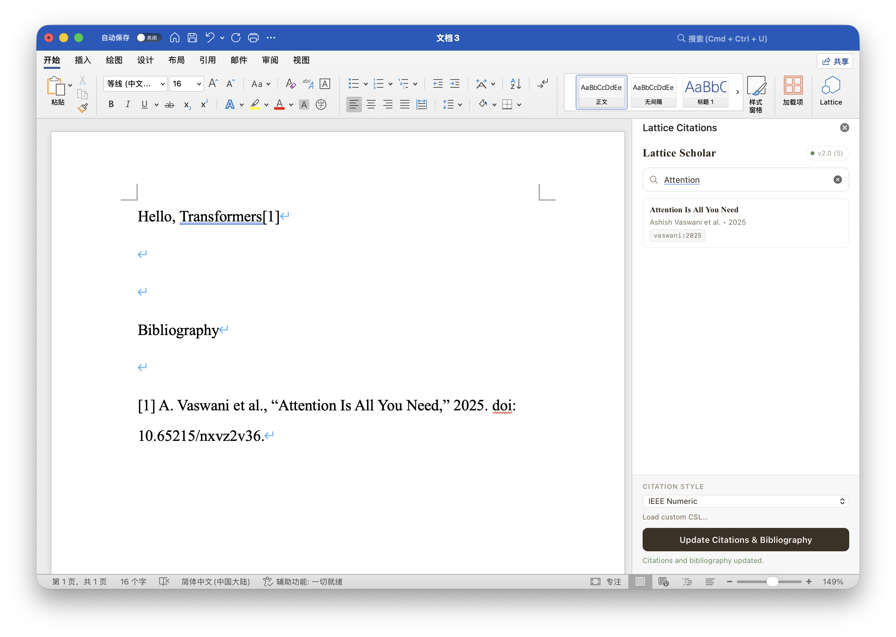

# Lattice Scholar Word 插件

[English](./README.md)



这个插件允许你在 Microsoft Word 里直接搜索 Lattice Scholar 文库、插入引用占位符，并在文档中生成格式化的引文和参考文献。

当前实现是一个由 Lattice 本地托管的 Office Add-in。它通过 `127.0.0.1` 上的 Lattice Local API 通信，并在 macOS 上将插件安装到本地 Word 容器中。

## 环境要求

- Lattice Scholar `> 1.2`
- 已在 Lattice Scholar 中启用 Local API
- 支持 `WordApi 1.4` 的 Microsoft Word
- 当前仓库内的安装脚本面向 macOS

## 插件功能

- 按标题、作者、年份或 citekey 搜索 Lattice 文库
- 当搜索框为空时显示最近文献
- 在当前 Word 光标位置插入引用占位符
- 使用 CSL 生成格式化引文和参考文献
- 内置两种引文样式：
  - `IEEE Numeric`
  - `APA 7th`
- 支持加载自定义 CSL 文件
- 将引文元数据和样式选择持久化保存到当前 Word 文档中

## 工作原理

这个插件依赖 Lattice Local API 和本地插件托管能力。

当前使用的 API 端点如下：

- `GET /api/v1/status`
- `GET /api/v1/search?q=...&limit=...`
- `GET /api/v1/papers/:id`

插件网页资源通过以下本地地址加载：

- `http://127.0.0.1:<port>/plugins/word-addin/...`

端口规则如下：

- 安装脚本会自动从 macOS defaults 键 `com.aurelian.Lattice:citationBridgePort` 读取端口
- 如果没有保存的端口，则默认使用 `52731`
- 正常使用时不需要手动指定端口
- 如果之后 Local API 端口发生变化，需要先卸载再重新安装 Word 插件，让 manifest 指向新的本地地址

由于采用了这种架构，所以在以下场景中必须保持 Lattice Scholar 正在运行：

- Word 插件连接 Lattice
- 搜索文库
- 拉取论文元数据
- 刷新引文与参考文献

## 安装方式

先下载发布包：

- Release 页面：
  `https://github.com/stringer07/Lattice_release/releases/tag/word-addin-v1.0.0.0`
- 当前 zip 直链：
  `https://github.com/stringer07/Lattice_release/releases/download/word-addin-v1.0.0.0/Lattice-Word-Addin-macOS-1.0.0.0.zip`

安装步骤：

1. 至少先启动一次 Lattice Scholar。
2. 在 Lattice Scholar 中启用 Local API。
3. 保持 Lattice Scholar 处于运行状态。
4. 下载 `Lattice-Word-Addin-macOS-1.0.0.0.zip`。
5. 解压下载得到的 zip 文件。
6. 打开解压后的 `Lattice-Word-Addin-macOS-1.0.0.0/word-addin/` 文件夹。
7. 双击 `install.command` 运行安装脚本。

如果你更习惯命令行，也可以执行：

```bash
cd Lattice-Word-Addin-macOS-1.0.0.0/word-addin
./install.command
```

如果 macOS 阻止脚本运行，可以在 Finder 中右键 `install.command`，选择“打开/Open”，然后再次确认打开。

安装完成后：

1. 完全退出 Microsoft Word。
2. 重新打开 Word。
3. 在 Word 的 `开始/Home` -> `加载项` 区域中打开 `Lattice`。

## 使用方法

1. 打开一个 Word 文档。
2. 点击 `开始/Home` -> `加载项`，然后打开 `Lattice`。
3. 等待连接状态徽标显示 Lattice 的应用版本号。
4. 按标题、作者、年份或 citekey 搜索文献。
5. 点击某条结果，在当前光标位置插入引用占位符。
6. 选择引文样式，或加载一个自定义 CSL 文件。
7. 点击 `Update Citations & Bibliography`。

点击更新后，会执行以下操作：

- 扫描文档中的 Lattice 引用控件
- 通过 Local API 补全缺失的文献元数据
- 按文档中的引用顺序重新渲染引文
- 在文档末尾插入或更新一个受管理的参考文献区块

## 卸载方式

1. 退出 Microsoft Word。
2. 打开之前解压得到的 `Lattice-Word-Addin-macOS-1.0.0.0/word-addin/` 文件夹。
3. 双击 `uninstall.command`。

如果你更习惯命令行，也可以执行：

```bash
cd Lattice-Word-Addin-macOS-1.0.0.0/word-addin
./uninstall.command
```

4. 重新打开 Word。

卸载会删除以下内容：

- 复制到 Lattice 容器中的插件文件
- 安装到 Word 本地 `wef` 目录中的 manifest 文件

如果是因为 Lattice Local API 端口发生变化，需要先按这个流程卸载，再重新运行 `./install.command` 安装一次。

## 贡献

欢迎提交 PR。

欢迎的内容不只限于 Word 插件本身，也包括：

- 改进 `word-addin`
- 提交新的、基于 Lattice Local API 的插件
- 改进安装流程
- 改进引文渲染与样式支持
- 增加脚注或尾注支持
- 为 Local API 插件补充文档、测试和示例

如果你准备提交 PR，建议在说明中包含：

- 这个改动解决了什么问题
- 是否引入了新的 Local API 假设或端点变更
- 是否需要额外的安装说明或迁移说明
- 用户可见行为的手动测试步骤

如果你正在基于 Local API 开发一个新插件，这个仓库也很适合作为贡献入口。
