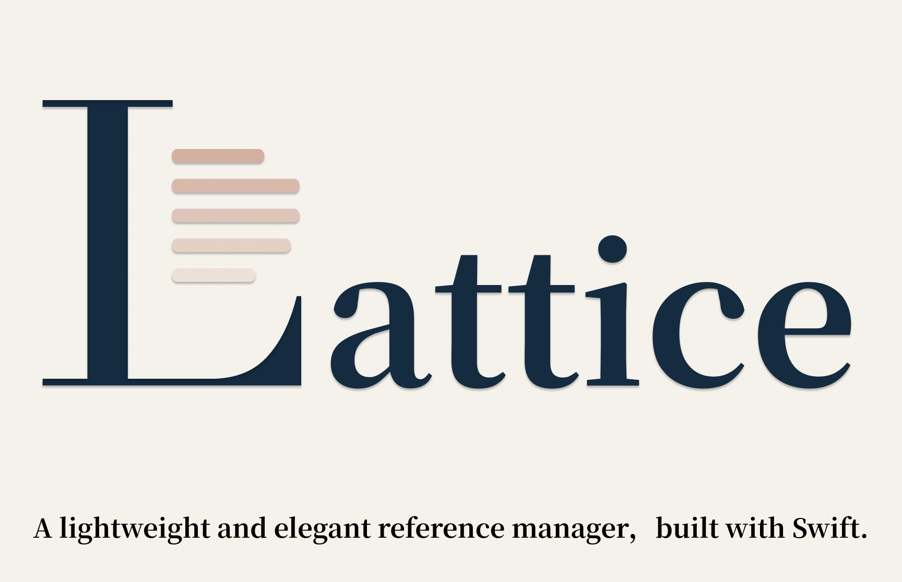
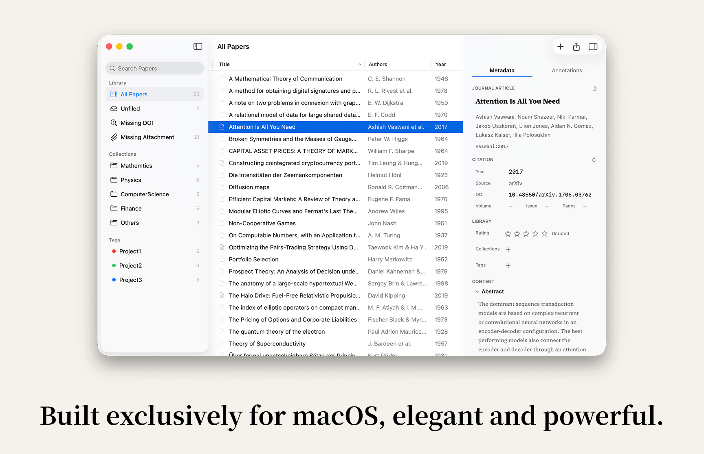
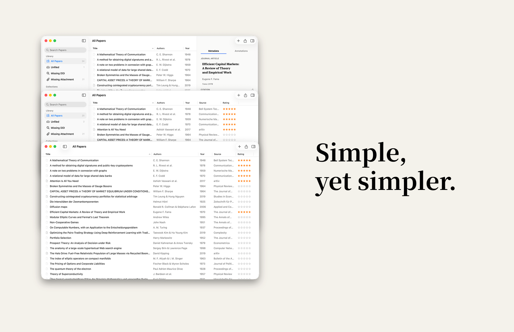
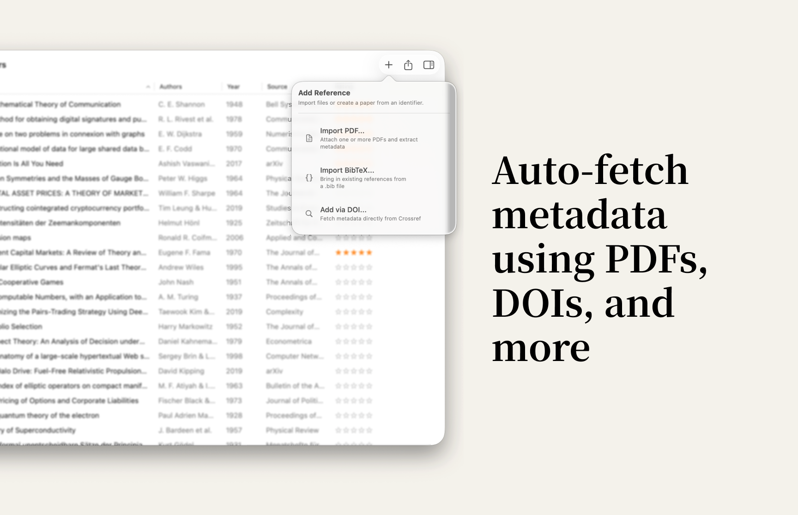
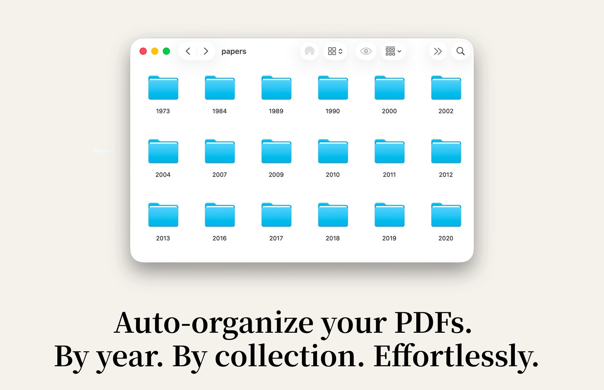
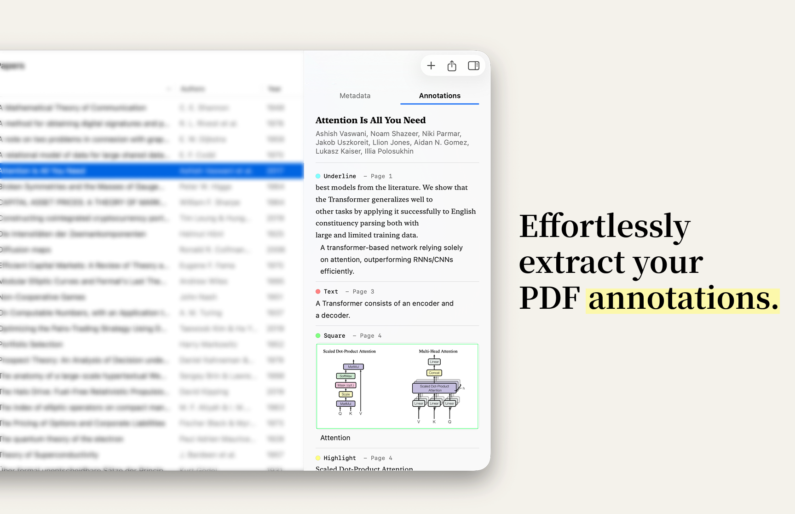
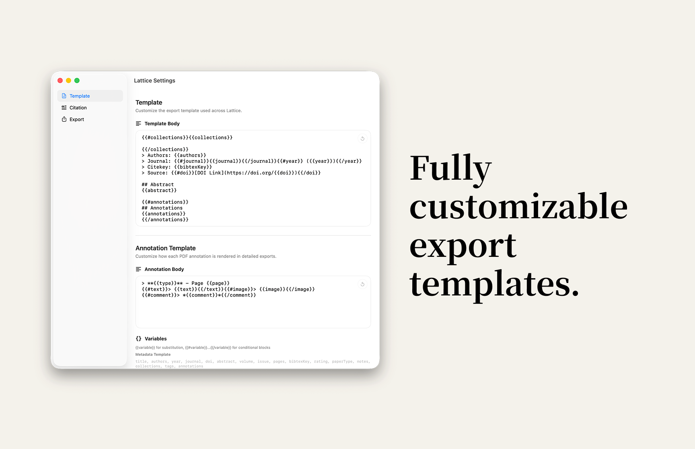
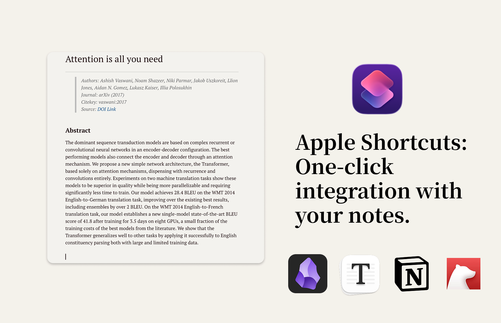

# Lattice Scholar

 [中文](./README.zh-CN.md) |  [Changelog](./CHANGELOG.md) 

> **⚠️ Test & Preview Version Notice**  
> This repository provides **test and preview versions** of Lattice Scholar, which are intended for test community feedback. Please note that **stability is not fully guaranteed** in these builds.
> 
> **Latest Beta on TestFlight**: You can test the newest beta builds on TestFlight: https://testflight.apple.com/join/xBV767wY
> 
> **Installation Note**: Due to being distributed outside the App Store, macOS may display a warning such as "Apple cannot verify this app" upon first launch. To open the app, please navigate to `System Settings` -> `Privacy & Security`, locate the security prompt, and click `Open Anyway`. 
> 
> **Get the Stable Release**: The official, polished version of Lattice is currently in preparation. Once officially launched, you will be able to **download the stable version from the Mac App Store**, which will offer the best stability and seamless automatic updates.

A lightweight literature manager built specifically for macOS.  
Lattice is written in native Swift. It is not a web wrapper, not an Electron shell, and not an attempt to replace your entire reading setup. Instead, it focuses on doing a few things extremely well: metadata management, PDF annotation extraction, template-based export, and automation-friendly integration with the rest of your workflow.



**System Requirement:** macOS 14.0 (Sonoma) or later. *Built to leverage native macOS technologies while keeping the experience polished and lightweight.*

## Overview

Lattice is built for a very specific kind of user:

- You work on macOS and want a literature app that feels like a real Mac app.
- You do not want your PDFs duplicated into a heavy private library database.
- You already have a preferred PDF reader, but you want a lightweight hub for metadata, notes, annotations, and export.
- You want your output in open formats that can move easily into Markdown, BibTeX, the clipboard, and Apple Shortcuts.

Lattice is not trying to be a giant all-in-one research platform. Its core idea is simpler:

- Use a native macOS experience for library management.
- Reduce manual metadata work with smart extraction and enrichment.
- Use templates and Shortcuts to move your papers into the writing and note-taking tools you already use.

## Design Philosophy

### 1. Native first, not web first

Lattice is built with native Swift technologies for macOS.  
That means real Mac behaviors: native windows, native sidebars, native tables, native Quick Look, and native Shortcuts integration.

It does not depend on a large web runtime to imitate a desktop app.  
The result is:

- lighter
- faster
- more stable
- more natural for long-term macOS use

### 2. Minimal, not stripped down

Lattice is minimal in the right places:

- the sidebar is for organization and filtering
- the center pane is for browsing and selection
- the inspector is for metadata and annotations

Core information stays visible in one coherent window. You do not have to jump through layers of views just to keep your library tidy.





### 3. Lightweight by design

Lattice is intentionally designed to avoid becoming a heavy document container.

- Native Swift app with a small footprint
- App size targeted below 20 MB
- Typical memory footprint targeted below 50 MB
- PDFs are linked, not duplicated into an internal sandbox
- No built-in full PDF reader, so the app stays focused and lean

Lattice is meant to cooperate with your files, not absorb them into a closed system.

### 4. Open workflows over lock-in

Lattice is built around open output:

- BibTeX import and export
- Markdown and TextBundle export
- customizable templates
- Apple Shortcuts integration
- clipboard-friendly metadata output

Your data stays portable, and your workflow stays yours.

## Core Strengths

### Native macOS experience

- Three-column layout: sidebar, paper table, detail inspector
- Native-style sidebar and table instead of web-like widgets
- Search, sorting, keyboard controls, context menus, and drag-and-drop
- A clean inspector for metadata and annotations

### Truly lightweight PDF management

- Lattice does not duplicate your PDFs into its own private store
- It keeps a secure link to the original file
- Your PDF remains in its original Finder location
- You can open it, reveal it in Finder, or replace the linked file at any time

This matters a lot if you already maintain a well-organized local paper library.

### Elegant and readable

Lattice is designed to feel calm and readable. Its spacing, typography, and hierarchy are tuned for long-term use. It avoids both extremes: the clutter of a dense database UI and the inefficiency of an over-designed showcase app.

## Features In Detail

### 1. Three-column main interface

The main window is built around three areas:

- left sidebar: Library, Collections, Tags
- center table: your paper list
- right inspector: Metadata / Annotations

The center table supports paper browsing across multiple columns:

- Title
- Authors
- Year
- Rating
- Source

You can:

- search by title, author, source, or year
- sort
- resize columns
- show or hide columns
- multi-select papers
- perform batch actions from the context menu

Keyboard behavior stays native and efficient:

- `Enter` opens the PDF
- `Space` triggers Quick Look
- `Delete` removes the selected paper

### 2. Library, Collections, and Tags

Lattice provides two complementary classification systems:

- `Collections`: structured grouping such as “Machine Learning”, “Economics”, “To Read”, or “Writing”
- `Tags`: cross-cutting labels such as “theory”, “empirical”, “important”, or “idea”

It also includes practical system views:

- All Papers
- Unfiled
- Missing DOI
- Missing Attachment

These make it easy to spot:

- papers that still need organizing
- papers with incomplete metadata
- papers that are missing a linked PDF

Collections and Tags both support:

- creation
- rename
- deletion
- drag-and-drop assignment

Tags can also carry colors for quick visual scanning.

### 3. Multiple import paths

Lattice supports three core ways to bring papers in:

#### PDF import

- import one or multiple PDFs from a file picker
- drag PDFs directly from Finder
- immediately extract baseline metadata from the file

#### BibTeX import

- import `.bib` files directly
- parse common BibTeX fields
- useful for migrating from an existing reference library

#### DOI import

- enter a DOI manually
- fetch paper metadata directly

Duplicate handling stays explicit and practical:

- Skip
- Replace
- batch imports can apply the same choice to all duplicates



### 4. Automatic metadata extraction and enrichment

Lattice does not rely on a single metadata source.

When you import a PDF or enter a DOI, Lattice can:

1. extract title, authors, and DOI from the PDF itself
2. scan the first pages for DOI or arXiv identifiers
3. query multiple academic metadata services
4. merge results to build a more complete paper record

It can fill or enrich:

- title
- authors
- year
- journal or venue
- DOI
- abstract
- volume / issue / pages
- paper type
- citekey

This makes Lattice equally useful for PDF-first workflows and DOI-first workflows.

### 5. No built-in PDF reader, on purpose

Many literature managers bundle a full PDF reader into the app. Lattice deliberately does not.

Instead, it focuses on:

- linking the PDF
- extracting PDF metadata
- extracting PDF annotations
- exporting the result into writing-friendly formats

Reading itself stays in the professional PDF app you already prefer.

That gives you several benefits:

- the app stays lighter
- the product stays more focused
- you do not have to abandon your existing reading habits
- you keep using the best reader for the job

### 6. Linked PDFs & Auto-organization on disk



Lattice handles PDFs in a deliberately restrained way. It does not duplicate your PDFs into its own private, hidden app sandbox. Instead, it creates a secure link to the attachment, keeping Lattice's storage footprint incredibly small.

But more than just linking, **Lattice can help you automatically organize your PDFs on your disk.**
In `Settings` -> `General`, you can specify a target folder (like an iCloud Drive or Dropbox folder for syncing) and choose an organization method (copy or move). Lattice will then automatically sort your PDFs into beautifully structured subfolders based on year, collection, or other criteria.

Your file structure remains clean, accessible, and completely under your control. From Lattice you can:

- open the PDF
- reveal the PDF in Finder
- replace the linked PDF

This is especially useful if you already maintain a local archive and want the manager to help you organize it automatically, rather than forcing you to migrate into a closed system.

### 7. Space-to-preview Quick Look

Select a paper in the list and press `Space` to preview the linked PDF with macOS Quick Look.

This is useful when you want to:

- quickly confirm the file
- inspect content without fully opening your reader
- keep a native macOS browsing habit

Lattice also refreshes annotation extraction around preview/open events so the paper stays in sync with the PDF on disk.

### 8. PDF annotation extraction

This is one of Lattice’s most distinctive features.

Lattice does not just know that a PDF exists. It actually reads the PDF’s annotations and turns them into structured data.

Supported annotation types include:

- Highlight
- Underline
- Strikethrough
- Text
- Free Text
- Square
- Circle

Each extracted annotation can preserve:

- annotation type
- page number / page label
- annotation position
- selected text
- user comment
- color
- cropped image data for shape annotations

You can browse these directly in the `Annotations` tab of the inspector.

For square and circle annotations, Lattice also renders an image of the marked region. This is particularly useful for:

- figures
- tables
- diagram snippets
- visual references that should survive export



### 9. Detail inspector

Each paper has a focused inspector on the right side of the main window.

The inspector has two tabs:

- Metadata
- Annotations

Inside Metadata, you can view and edit:

- title
- authors
- year
- source
- DOI
- volume / issue / pages
- abstract
- notes
- rating
- collections
- tags

That makes Lattice more than just an importer. It becomes a lightweight maintenance hub for your paper library.

### 10. Template-based export

Lattice does not lock you into a fixed export layout.

You can customize two separate templates:

- Metadata Template
- Annotation Template

The syntax is intentionally simple:

- `{{variable}}` for substitution
- `{{#field}} ... {{/field}}` for conditional blocks

Example:

```md
# {{title}}

> Authors: {{authors}}
> Journal: {{#journal}}{{journal}}{{/journal}}{{#year}} ({{year}}){{/year}}
> Citekey: {{bibtexKey}}
> Source: {{#doi}}[DOI Link](https://doi.org/{{doi}}){{/doi}}

## Abstract
{{abstract}}

{{#annotations}}
## Annotations
{{annotations}}
{{/annotations}}
```

Available variables:

#### Metadata template variables

`title, authors, year, journal, doi, abstract, volume, issue, pages, bibtexKey, rating, paperType, notes, collections, tags, annotations`

#### Annotation template variables

`type, page, text, comment, color, image`

This gives you real control over how a paper becomes a note.



### 11. Markdown and TextBundle export

Detailed export can produce two kinds of output:

- `.md` when no image assets are needed
- `.textbundle` when annotation images should travel with the note

TextBundle is especially useful because:

- the Markdown body stays clean
- image assets are packaged alongside the text
- shape-based PDF annotations can be exported with visual context intact

Filename behavior is also practical and stable:

- prefer an existing citekey if present
- otherwise derive a filename from the paper title
- automatically resolve naming collisions

### 12. BibTeX workflow

Lattice is not only able to import BibTeX. It can also export BibTeX cleanly.

Supported behaviors include:

- export to `.bib`
- customizable citekey formats
- field-level export control
- automatic duplicate-key handling

Citekeys can be generated from patterns such as:

- `{auth}{year}`
- `{Auth}{year}`
- `{auth}:{shortyear}`
- `{auth}{title}`

That makes Lattice easy to integrate into LaTeX, Pandoc, and broader research-writing workflows.

### 13. Apple Shortcuts and automation

Lattice integrates directly with Apple Shortcuts.

You can use a Shortcut to:

- choose a paper
- render metadata using your default template
- return the text or copy it to the clipboard
- optionally include extracted PDF annotations

This makes it easy to connect Lattice to tools like:

- Obsidian
- Bear
- Notion
- any other app or workflow that can consume clipboard text or Shortcut output

Lattice is not trying to replace your notes app. It is trying to connect your paper library to it.



### 14. Everyday quality-of-life details

Beyond the headline features, Lattice includes many details that matter in daily use:

- star ratings
- notes
- paper search
- batch selection
- context-menu actions
- batch metadata refresh
- batch export
- batch assignment to Collections and Tags
- open PDF, reveal in Finder, replace PDF

This is what gives Lattice its “lightweight but fully useful” character.

## Why Lattice is worth keeping around

Lattice matters because of the tradeoffs it makes:

- native Mac experience instead of a web shell
- lightweight structure instead of a bloated library database
- linked PDFs instead of duplicated PDFs
- open template export instead of closed output
- Shortcuts and clipboard workflows instead of isolation
- cooperation with professional PDF readers instead of forcing an embedded one

If you want:

- a truly elegant literature manager for macOS
- a genuinely lightweight daily tool
- a bridge between PDF annotations, metadata, and your note system

Lattice is built for that exact job.

## Typical Workflows

### Workflow 1: From PDF to notes

1. Drag a PDF into Lattice
2. Lattice extracts title, authors, DOI, and enriches the record online
3. Read and annotate in your preferred PDF app
4. Return to Lattice to inspect and extract those annotations
5. Export to Markdown or TextBundle
6. Send the result into Obsidian, Bear, Notion, or another note system

### Workflow 2: From DOI to paper card

1. Enter a DOI
2. Fetch the paper metadata
3. Add Collections, Tags, Notes, and Rating
4. Export as a structured note or a BibTeX entry

### Workflow 3: Manage a local PDF archive without duplicating files

1. Keep PDFs in your own Finder folders
2. Link them from Lattice
3. Use Search, Collections, Tags, and Missing DOI / Missing Attachment views to organize the library
4. Continue reading in the PDF app you already trust
