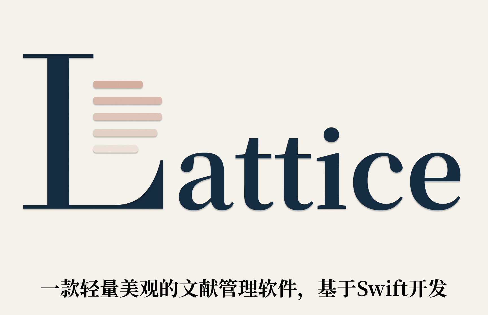
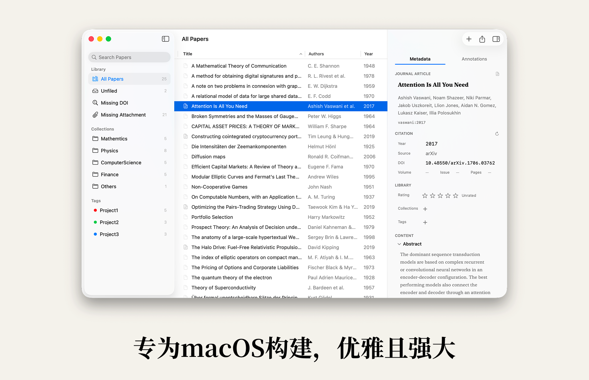
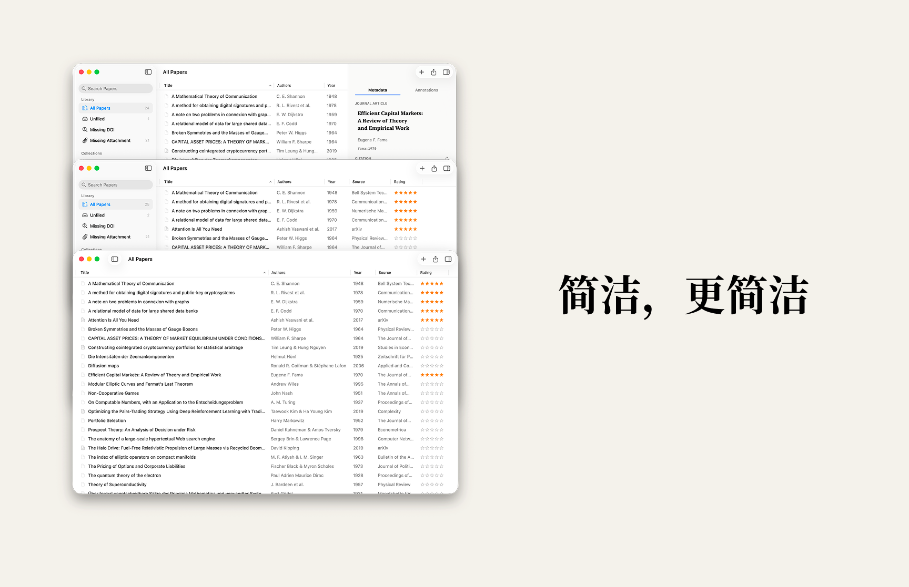
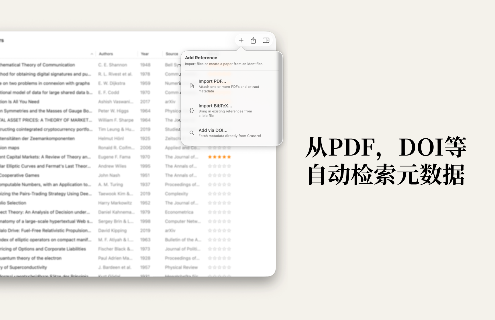
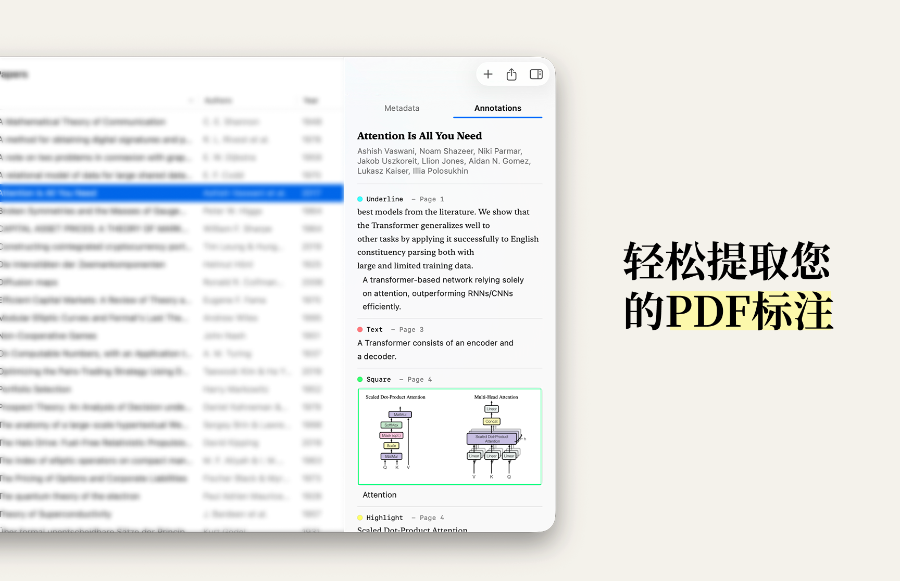
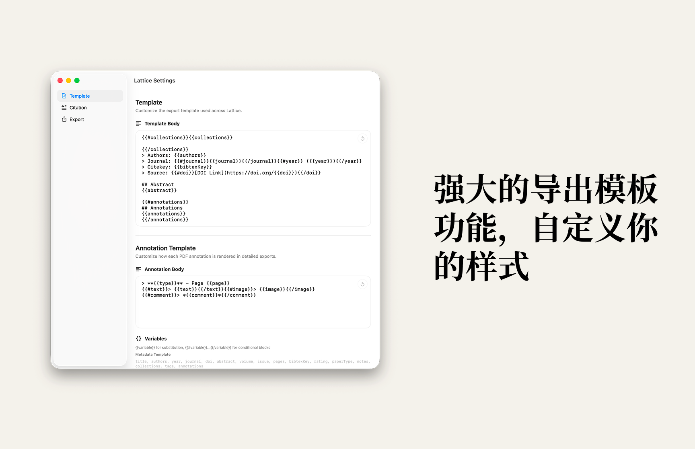
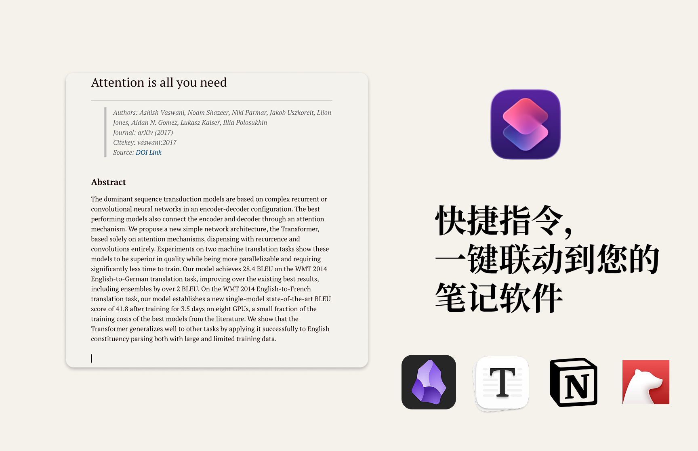

# Lattice

 [English](./README.md) | 更新日志: [CHANGELOG.zh-CN.md](./CHANGELOG.zh-CN.md) 

> **安装提示**  
> 首次打开应用时，macOS 可能会提示“无法验证该应用是否安全”或类似警告。这是因为当前版本尚未通过 Apple Developer Program 完成签名与公证。由于目前仍是个人独立开发阶段，暂未加入 Apple Developer Program（年费 99 美元）。若需要继续打开，请前往 `系统设置` -> `隐私与安全性`，在相关安全提示处点击 `仍要打开`。后续会根据使用反馈继续完善，并考虑提供经过正式签名与公证的版本。该应用也是开发者本人日常使用的软件，不包含恶意代码。

一款专为 macOS 打造的轻量文献管理软件。  
基于 Swift 原生开发，不是网页壳，不是 Electron，不试图接管你的整套阅读工作流，而是专注把文献管理、元数据整理、PDF 标注提取、模板导出和自动化联动这几件事做到优雅、简洁、可靠。



## 概览

Lattice 面向的是一类很明确的用户:

- 你在 macOS 上工作，希望文献管理软件看起来像一个真正的 Mac 应用，而不是一个被打包起来的网页。
- 你不想为了管理文献，把所有 PDF 再复制一份到某个庞大的数据库或沙盒里。
- 你已经有自己喜欢的 PDF 阅读器，但希望有一个轻量的中枢，帮你管理元数据、提取标注、整理笔记、导出到其他工具。
- 你希望输出格式是开放的，能直接进入 Markdown、BibTeX、剪贴板和 Apple 快捷指令的工作流。

Lattice 的核心不是“把所有事情都塞进一个大而全的界面里”，而是:

- 用原生 macOS 体验承载文献管理。
- 用自动化能力减轻元数据录入和整理负担。
- 用模板和快捷指令，把文献内容送到你真正使用的写作与笔记工具中。

## 设计哲学

### 1. 原生，而不是网页壳

Lattice 使用 Swift 原生开发，界面建立在 macOS 原生能力之上。  
这意味着它拥有真正的 Mac 交互手感: 原生窗口、原生侧边栏、原生表格、原生 Quick Look、原生快捷指令集成。

这也意味着它不需要用一个庞大的网页运行时来模拟桌面应用。  
结果就是:

- 更轻
- 更快
- 更稳定
- 更符合 macOS 用户的直觉

### 2. 极简，但不是简陋

Lattice 的“简洁”不是删功能，而是把界面压缩到真正有价值的部分:

- 左侧做组织与筛选
- 中间做列表与选择
- 右侧做元数据与标注查看

所有核心信息都在同一主窗口内完成，不需要层层弹窗，不需要跳转到复杂的页面迷宫里。





### 3. 轻量优先

Lattice 从设计上就避免变成一个沉重的“文献数据库容器”。

- 原生 Swift 应用，体积小，启动快
- 应用本体轻量，目标是保持在小于 20 MB 的级别
- 日常运行内存占用低，目标是控制在 50 MB 以内
- PDF 不复制入库，而是保留到原始文件的安全链接
- 不内置沉重的 PDF 阅读器，把阅读交回给你习惯的专业工具

Lattice 不是把你的文件“吃进去”，而是以尽量轻的方式和它们协作。

### 4. 开放，而不是封闭

Lattice 的输出思路是开放的:

- 支持 BibTeX 导入与导出
- 支持 Markdown / TextBundle 导出
- 支持模板自定义
- 支持 Apple 快捷指令
- 支持复制元数据到剪贴板

这意味着你的数据不会被锁死在某个难以迁移的格式里。

## 核心优势

### 原生 macOS 体验

- 三栏主界面: 侧边栏、文献表格、详情检查器
- 原生风格的 sidebar 和 table，而不是硬套网页式组件
- 支持搜索、排序、键盘操作、右键菜单、拖拽
- 选中文献后即可在右侧查看元数据或标注

### 真正轻量的 PDF 管理

- Lattice 不把 PDF 再复制一份到自己的沙盒数据库里
- 它只保存到原文件的安全链接
- 你的 PDF 仍然在原来的 Finder 目录中
- 可以一键打开 PDF、一键在 Finder 中定位、一键替换链接文件

这一点对长期积累文献库尤其重要。  
你的文件结构仍然由你控制，而不是被应用重新托管。

### 优雅与美观

Lattice 的排版、留白、界面层级和字体使用都围绕“阅读感”来设计。  
它既不是信息密度过高的数据库界面，也不是为了视觉而牺牲效率的展示页，而是在二者之间找到一个更适合长期使用的平衡。

## 功能详解

### 1. 三栏式主界面

Lattice 的主界面由三部分组成:

- 左侧边栏: Library、Collections、Tags
- 中间列表: 文献总表
- 右侧详情: Metadata / Annotations

中间列表支持按多个维度浏览与管理:

- Title
- Authors
- Year
- Rating
- Source

你可以进行:

- 搜索标题、作者、期刊、年份
- 排序
- 列宽调整
- 列显示/隐藏
- 多选
- 右键批量操作

键盘交互也保持了原生直觉:

- `Enter` 打开 PDF
- `Space` 触发 Quick Look 预览
- `Delete` 删除文献

### 2. Library、Collections 与 Tags

Lattice 提供两种纵向分类方式:

- `Collections`: 适合做结构化归档，比如“Machine Learning”“Economics”“To Read”“Writing”
- `Tags`: 适合做横向标签，比如“theory”“empirical”“important”“idea”

同时也内置了一组非常实用的系统视图:

- All Papers
- Unfiled
- Missing DOI
- Missing Attachment

这让你可以很快发现:

- 还没归类的文献
- DOI 不完整的文献
- 还没绑定 PDF 的文献

Collections 和 Tags 都支持持续管理:

- 新建
- 重命名
- 删除
- 拖拽文献加入

Tags 还支持颜色设置，便于视觉区分。

### 3. 多种导入方式

Lattice 支持三种核心导入方式:

#### PDF 导入

- 支持文件选择器导入一个或多个 PDF
- 支持从 Finder 直接拖入 PDF
- 导入后会立刻尝试从 PDF 中提取基础信息

#### BibTeX 导入

- 可直接导入 `.bib` 文件
- 会解析常见的 BibTeX 字段
- 适合从其他参考文献管理器迁移已有条目

#### DOI 导入

- 手动输入 DOI
- 直接在线获取文献元数据

对于重复条目，Lattice 提供清晰的冲突处理:

- Skip
- Replace
- 批量导入时支持对全部重复项应用同一策略



### 4. 自动提取与补全文献元数据

Lattice 的元数据流程不是单点查询，而是多来源补全。

当你导入 PDF 或输入 DOI 时，Lattice 会:

1. 先尝试从 PDF 中提取标题、作者和 DOI
2. 如果没有 DOI，就扫描 PDF 前几页中的 DOI / arXiv 信息
3. 再通过外部学术元数据源补全信息
4. 合并多来源结果，尽量得到更完整的条目

可自动补全的信息包括:

- 标题
- 作者
- 年份
- 期刊 / 会议
- DOI
- 摘要
- 卷号 / 期号 / 页码
- 论文类型
- citekey

这让 Lattice 既适合从 PDF 开始，也适合从 DOI 开始。

### 5. 不内置 PDF 阅读器，是刻意的选择

很多文献管理软件把 PDF 阅读器内置在应用里，但 Lattice 选择了另一条路线:

- 不内置沉重的阅读器
- 不接管你全部的阅读行为
- 不重复造一个专业 PDF 工具的轮子

Lattice 的角色更像一个轻量中枢:

- 帮你连接 PDF
- 帮你提取 PDF 元数据
- 帮你提取 PDF 标注
- 帮你导出成适合写作和笔记的软件格式

而真正的阅读，你依然可以交给自己喜欢的专业 PDF 应用。

这样的好处是:

- 应用更轻
- 结构更清晰
- 你不需要迁移已有阅读习惯
- 你可以继续使用最顺手的阅读器

### 6. 轻量 PDF 连接，而不是复制存储

Lattice 对 PDF 的处理方式非常克制:

- 只创建到 PDF 原文件的链接
- 不把 PDF 拷贝到自己的私有目录
- 不制造重复文件
- 不改变你现有的文件组织方式

你可以在 Lattice 中:

- 打开 PDF
- 在 Finder 中定位 PDF
- 替换关联 PDF

这对已经拥有整理良好的本地文献库的人尤其友好。  
Lattice 尊重你已有的目录结构，而不是要求你重新迁移进一个封闭系统。

### 7. Space 快速预览

在文献列表中选中文献后，按下 `Space` 即可调用 macOS Quick Look 预览关联 PDF。

这意味着:

- 不必完整打开外部阅读器也能快速看一眼内容
- 保留原生 macOS 的浏览习惯
- 适合快速确认文件是否正确、内容是否匹配

而且在预览或打开 PDF 后，Lattice 也会顺带刷新该文献的标注提取状态。

### 8. PDF 标注提取

这是 Lattice 最有特色的能力之一。

Lattice 不只是“知道你有一个 PDF”，它还会真正去读取其中的标注内容，并把它们提取成结构化数据。

支持的标注类型包括:

- Highlight
- Underline
- Strikethrough
- Text
- Free Text
- Square
- Circle

提取后的标注会保留:

- 标注类型
- 页码 / 页标签
- 标注位置
- 选中文本
- 批注内容
- 颜色
- 图形标注的局部截图

你可以直接在右侧 `Annotations` 标签页中查看这些内容。

对于方框和圆圈这类图形标注，Lattice 还会自动生成对应区域的图片，这一点非常适合:

- 截取论文中的图表
- 保留示意图
- 导出到笔记时带上视觉上下文



### 9. 右侧详情面板

每一篇文献都可以在右侧检查器里进行集中查看与编辑。

详情面板支持两种模式:

- Metadata
- Annotations

在 Metadata 中，你可以查看和编辑:

- 标题
- 作者
- 年份
- 来源
- DOI
- 卷号 / 期号 / 页码
- 摘要
- Notes
- Rating
- Collections
- Tags

这让 Lattice 不只是导入器，也是真正可日常维护的文献信息中枢。

### 10. 模板化导出

Lattice 的导出功能不是固定模板写死，而是支持模板定义。

你可以分别自定义:

- Metadata Template
- Annotation Template

模板语法非常直观:

- `{{variable}}` 用于变量替换
- `{{#field}} ... {{/field}}` 用于条件块

例如:

```md
# {{title}}

> Authors: {{authors}}
> Journal: {{#journal}}{{journal}}{{/journal}}{{#year}} ({{year}}){{/year}}
> Citekey: {{bibtexKey}}
> Source: {{#doi}}[DOI Link](https://doi.org/{{doi}}){{/doi}}

## Abstract
{{abstract}}

{{#annotations}}
## Annotations
{{annotations}}
{{/annotations}}
```

可用变量包括:

#### 元数据模板变量

`title, authors, year, journal, doi, abstract, volume, issue, pages, bibtexKey, rating, paperType, notes, collections, tags, annotations`

#### 标注模板变量

`type, page, text, comment, color, image`

这意味着你可以:

- 导出成你喜欢的 Markdown 结构
- 对接 Obsidian / Bear / Notion / Typora 等写作与笔记环境
- 为不同写作项目定义不同的文献卡片格式



### 11. Markdown 与 TextBundle 导出

Lattice 的详细导出支持两种结果:

- 没有图片时，导出为 `.md`
- 当标注中包含图形截图时，导出为 `.textbundle`

`.textbundle` 的好处是:

- Markdown 正文和图片资源分离得更清晰
- 图像标注可以一起打包导出
- 适合需要把论文标注带到笔记系统里的工作流

文件名也会尽可能稳定:

- 优先使用已有 citekey
- 否则按标题生成文件名
- 自动处理重名冲突

### 12. BibTeX 工作流

Lattice 不只是能导入 BibTeX，也能高质量导出 BibTeX。

支持内容包括:

- 导出 `.bib`
- 自定义 citekey 格式
- 控制导出字段
- 自动处理重复 key

citekey 支持根据模板生成，例如:

- `{auth}{year}`
- `{Auth}{year}`
- `{auth}:{shortyear}`
- `{auth}{title}`

这对需要与 LaTeX、Pandoc、Zotero 兼容写作链路的人非常实用。

### 13. Apple 快捷指令与自动化联动

Lattice 深度集成了 Apple Shortcuts。

你可以通过快捷指令直接:

- 选择某篇文献
- 输出渲染后的元数据文本
- 选择返回文本，或直接复制到剪贴板
- 可选是否包含 PDF 标注

这让 Lattice 能非常自然地接入你的笔记工作流，例如:

- 一键发送到 Obsidian
- 一键复制到 Bear
- 一键粘贴到 Notion
- 串联到任意支持快捷指令的自动化流程

本质上，Lattice 不是在和你的其他工具竞争，而是在成为它们之间的桥梁。



### 14. 日常管理细节

除了上面的重点功能，Lattice 还包含许多对日常使用很重要的细节:

- 星级评分
- Notes 备注
- 文献搜索
- 批量选择
- 右键菜单操作
- 批量刷新元数据
- 批量导出
- 批量分类到 Collections / Tags
- 打开 PDF、在 Finder 中显示、替换 PDF

这些细节共同构成了它“轻量但够用”的使用体验。

## 为什么 Lattice 值得长期使用

Lattice 的价值不在于“功能数量最多”，而在于它做出了一组非常清晰的取舍:

- 用原生 Mac 体验替代网页壳
- 用轻量结构替代臃肿数据库
- 用链接 PDF 替代复制 PDF
- 用模板导出替代封闭格式
- 用快捷指令联动替代孤立工作流
- 用专业阅读器协作替代内置阅读器堆功能

如果你希望拥有一个:

- 真正好看的 macOS 文献管理工具
- 真正轻量、不拖累系统的日常工具
- 真正能把 PDF 标注和元数据送进笔记系统的桥梁

那么 Lattice 就是为此而设计的。

## 典型工作流

### 工作流 1: 从 PDF 到笔记

1. 把 PDF 拖入 Lattice
2. Lattice 自动提取标题、作者、DOI，并在线补全摘要等元数据
3. 在你喜欢的 PDF 阅读器里完成阅读和标注
4. 回到 Lattice 查看并提取这些标注
5. 用模板导出成 Markdown / TextBundle
6. 通过快捷指令或剪贴板发送到 Obsidian、Bear、Notion 等工具

### 工作流 2: 从 DOI 到文献卡片

1. 输入 DOI
2. 自动获取文献元数据
3. 添加 Collections、Tags、Notes、Rating
4. 导出为文献卡片或 BibTeX 条目

### 工作流 3: 管理本地文献库而不复制 PDF

1. 保持 PDF 原本就在你的 Finder 目录中
2. 用 Lattice 连接这些 PDF
3. 用 Search、Collections、Tags 和 Missing DOI / Missing Attachment 做整理
4. 继续用最熟悉的 PDF 阅读器完成阅读
